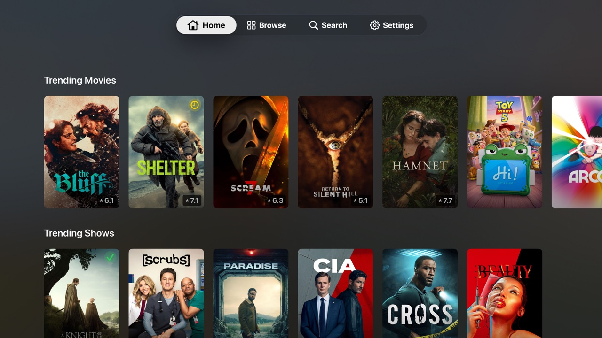
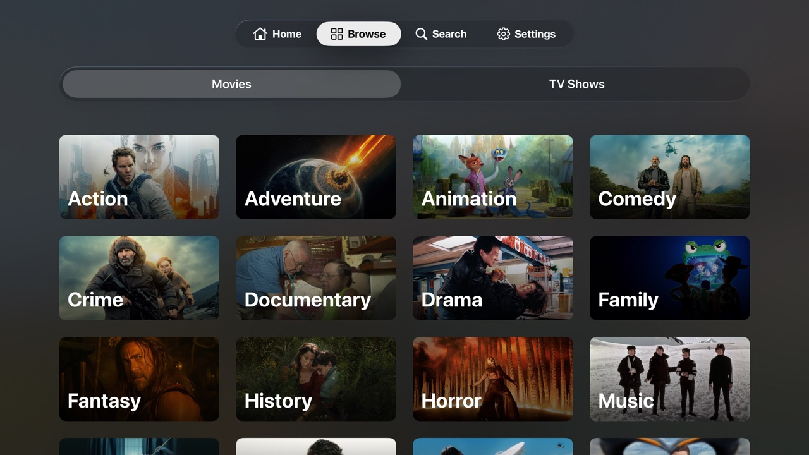
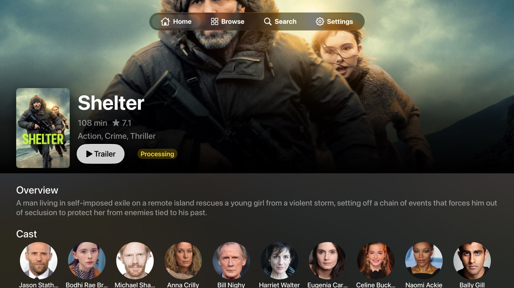
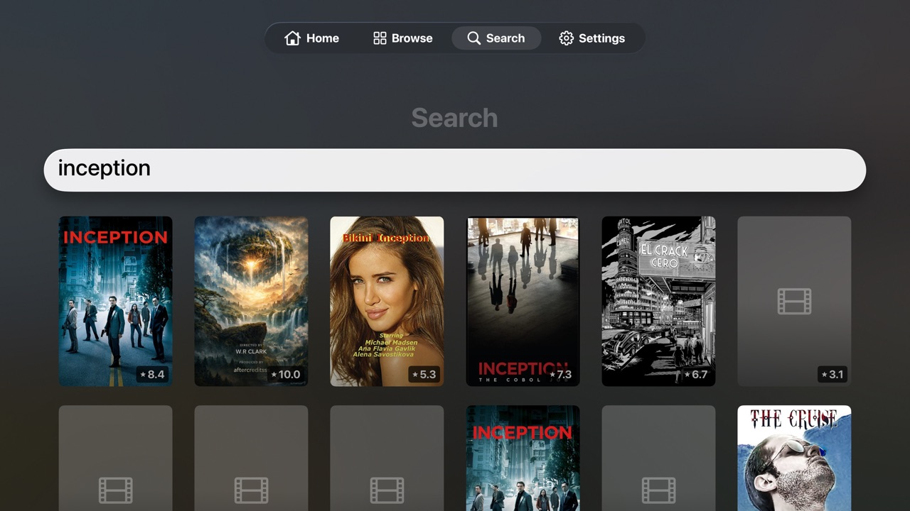

# Curator

A native tvOS app that turns your Apple TV into a powerful media discovery hub. Browse trending films, get personalized recommendations powered by your watch history, and request new content — all from your couch with the Siri Remote.

Curator connects to [Overseerr](https://overseerr.dev/) for media requests and availability tracking, with optional [Trakt](https://trakt.tv/) integration that unlocks personalized recommendations, anticipated titles, and hidden gems based on what you've watched.



## Highlights

- **Personalized home screen** — "Because you watched..." recommendations, trending, popular, most anticipated, most watched this week, top rated, and hidden gems — all in horizontally-scrollable shelves
- **Genre browsing** — Full genre grid with backdrop art for movies and TV shows
- **Instant search** — Debounced search across your entire Overseerr library with ratings and availability at a glance
- **Rich detail views** — Full-bleed backdrop hero, cast & crew, keywords, "More from Director / Lead Actor" shelves, and "You Might Like" recommendations
- **One-tap requests** — Request unavailable content with Radarr/Sonarr quality profile selection
- **Inline trailers** — Watch trailers without leaving the app, with adaptive streaming up to 1080p+ and automatic codec filtering for tvOS compatibility
- **Trakt-powered discovery** — OAuth device code flow (no awkward on-screen typing), personalized ML recommendations, and watch history integration
- **Availability badges** — Every poster shows whether content is available, requested, processing, or ready to request
- **Fully native** — Built entirely with SwiftUI, optimized for the Siri Remote with proper focus management, card parallax effects, and native tvOS navigation patterns

## Screenshots

| Home | Browse |
|------|--------|
|  |  |

| Detail | Search |
|--------|--------|
|  |  |

## Requirements

- tvOS 17.0+
- Xcode 15+ with the tvOS SDK
- An [Overseerr](https://overseerr.dev/) instance with API access
- (Optional) A [Trakt](https://trakt.tv/) account for personalized recommendations

## Getting Started

The project uses [XcodeGen](https://github.com/yonaskolb/XcodeGen) to generate the Xcode project from `project.yml`.

```bash
# Install XcodeGen
brew install xcodegen

# Generate the Xcode project
xcodegen generate

# Set up secrets (Trakt credentials, debug tokens)
cp Curator/Config/Secrets.xcconfig.example Curator/Config/Secrets.xcconfig
# Edit Secrets.xcconfig with your values

# Open in Xcode
open Curator.xcodeproj
```

Select the **Curator** scheme, pick an Apple TV simulator, and hit Run.

On first launch, the onboarding flow walks you through connecting to Overseerr (URL + API key) and optionally linking your Trakt account. Credentials are stored securely in the Keychain.

## Architecture

```
SwiftUI Views → @Observable ViewModels → actor Services → Codable Models
```

- **MVVM with @Observable** — Swift 5.9+ macro, no Combine
- **Actor-based API clients** — `OverseerrClient`, `TraktClient`, and `MediaResolver` are all Swift actors for thread-safe concurrent access
- **Structured concurrency** — `async let` for parallel loads (11 concurrent shelf fetches on the home screen), `withTaskGroup` for fan-out resolution of Trakt items through Overseerr
- **Graceful degradation** — Works with Overseerr alone; Trakt unlocks personalization. Individual shelf failures never break the home screen
- **Zero third-party dependencies** — URLSession, AsyncImage, AVKit, Security (Keychain), and nothing else

## Project Structure

```
Curator/
  App/              App entry point (@main) and AppState (global @Observable singleton)
  Components/       Reusable UI — hero view, media cards, shelves, trailer player, status pills
  Models/           Codable structs for Overseerr and Trakt API responses + unified MediaItem
  Services/         Actor-based API clients, MediaResolver (cross-API orchestration), ImageService
  Utilities/        KeychainHelper, constants, UserDefaults keys
  ViewModels/       @Observable view models for each screen
  Views/            SwiftUI views organized by feature (Home, Browse, Search, Detail, Settings, Onboarding)
CuratorTests/       Unit tests with MockURLProtocol-based network mocking (63 tests)
CuratorUITests/     UI tests for navigation, content loading, and screenshots (12 tests)
```

## Testing

```bash
# Run all unit tests
xcodebuild test -project Curator.xcodeproj -scheme CuratorTests \
  -destination 'platform=tvOS Simulator,name=Apple TV 4K (3rd generation)'

# Run a single test class
xcodebuild test -project Curator.xcodeproj -scheme CuratorTests \
  -destination 'platform=tvOS Simulator,name=Apple TV 4K (3rd generation)' \
  -only-testing:CuratorTests/KeywordDiscoveryTests

# Run UI tests (requires a configured Overseerr connection on the simulator)
xcodebuild test -project Curator.xcodeproj -scheme CuratorUITests \
  -destination 'platform=tvOS Simulator,name=Apple TV 4K (3rd generation)'
```

## Tech Stack

- **Swift 6** with strict concurrency checking
- **SwiftUI** for all UI, fully optimized for tvOS focus system
- **AVKit** for trailer playback with adaptive stream composition and Dolby Vision handling
- **async/await** throughout — no callbacks, no Combine
- **XcodeGen** for declarative project generation from `project.yml`
- **XCTest** with `MockURLProtocol` for hermetic network testing
